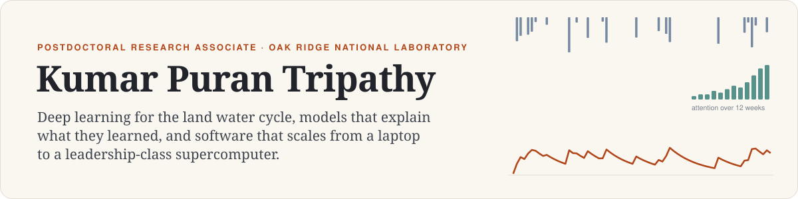
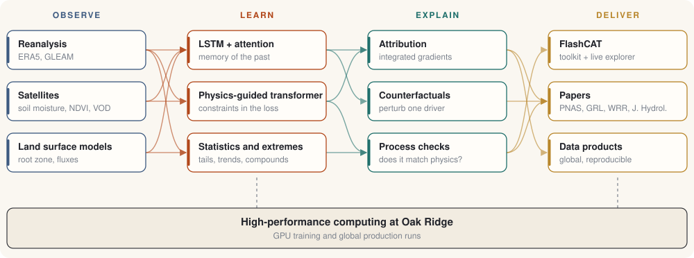

<a href="https://ktripa.github.io">
  <picture>
    <source media="(prefers-color-scheme: dark)" srcset="assets/banner-dark.svg">
    
  </picture>
</a>

  <a href="https://ktripa.github.io"><b>Website</b></a> &nbsp;·&nbsp;
  <a href="https://ktripa.github.io/writing/"><b>Writing</b></a> &nbsp;·&nbsp;
  <a href="https://scholar.google.com/citations?user=wMA_dkQAAAAJ&hl=en">Google Scholar</a> &nbsp;·&nbsp;
  <a href="https://www.linkedin.com/in/kumar-p-tripathy-ph-d-91447517a/">LinkedIn</a> &nbsp;·&nbsp;
  <a href="https://orcid.org/0000-0002-2451-0166">ORCID</a> &nbsp;·&nbsp;
  <a href="mailto:tripathypuranbdk@gmail.com">Email</a>

I am a postdoctoral research associate at **Oak Ridge National Laboratory**. I build deep
learning models of how water moves through the land, make them explain what they learned,
and package the result as software other people can run. Ph.D. Texas A&M, M.Tech. IISc
Bangalore. Work published in **PNAS**, **GRL**, **WRR** and **Journal of Hydrology**,
1,070+ citations.

### How the work fits together

<picture>
  <source media="(prefers-color-scheme: dark)" srcset="assets/stack-dark.svg">
  
</picture>

### Featured work

<table>
<tr>
<td width="56%" valign="top">

</td>
<td valign="top">

**[FlashCAT](https://ktripa.github.io/software.html)**: Flash drought Computation and
Analytics Toolkit. Six flash drought indices, three classical ones and four
evapotranspiration estimators behind one call that takes NumPy, pandas, CSV or NetCDF and
returns the same type. Run globally at 0.25° for 1980 to 2022.

[Live global explorer](https://ktripa.github.io/flashcat/) ·
[Figures](https://ktripa.github.io/flashcat-figures.html) ·
[Docs](https://ktripa.github.io/flashcat/docs/)

</td>
</tr>
</table>

| Project | What it is |
|---|---|
| [**wf_lstm_attn**](https://github.com/ktripa/wf_lstm_attn) | Fire Weather Index attribution for TX, OK, NM and AZ. Three-branch PyTorch model: concurrent weather, a 12-week antecedent fuel memory pooled by additive attention, and static landscape. Branch ablations built in. |
| [**drought_indices_python**](https://github.com/ktripa/drought_indices_python) | SPI, SPEI and PET on [PyPI](https://pypi.org/project/drought-indices-python/). Drought indices that usually live in C++ or R, in Python. |
| [**deep-learning-python-kumar**](https://github.com/ktripa/deep-learning-python-kumar) | Companion notebooks for *Deep Learning with Python*. |

### Writing

Long-form explainers with figures you can play with.

- [**What an LSTM remembers about rain**](https://ktripa.github.io/writing/lstm-reservoir.html): an LSTM cell with frozen gates is a linear reservoir; give the gates a thermometer and it learns a snowpack.
- [**Where the compute should go**](https://ktripa.github.io/writing/scaling-laws.html): compute-optimal scaling laws, and why scientific foundation models hit a data wall first.
- [**Why your GPU is mostly waiting**](https://ktripa.github.io/writing/roofline.html): the roofline model, arithmetic intensity, and what to change before asking for more nodes.
- [**A qubit you can turn by hand**](https://ktripa.github.io/writing/bloch-sphere.html): every single-qubit gate is a rotation; interference on a draggable Bloch sphere.

### Selected papers

- **Climate change will accelerate the high-end risk of compound drought and heatwave events.** *PNAS*, 2023.
- **Deep learning reveals the role of climate drivers in shaping hydrological droughts.** *Water Resources Research*, 2026.
- **Lagged soil moisture controls on the persistence of drought and heatwaves in the United States.** *Geophysical Research Letters*, 2025.
- **Deep learning in hydrology and water resources disciplines: concepts, methods, applications, and research directions.** *Journal of Hydrology*, 2024.

[All publications →](https://ktripa.github.io/publications.html)

### Toolbox

`Python` · `PyTorch` · `NumPy / SciPy / pandas` · `xarray / NetCDF` · `GPU clusters` · `LSTMs, transformers, attention` · `explainable AI` · `extreme value statistics`
